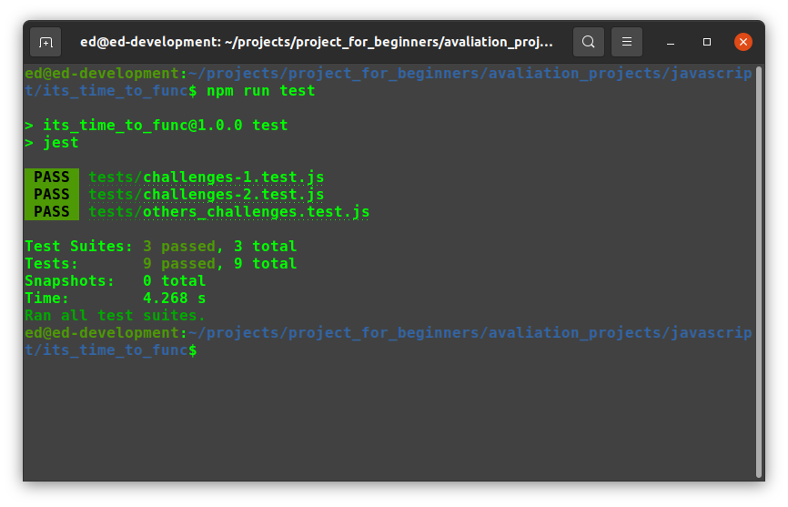
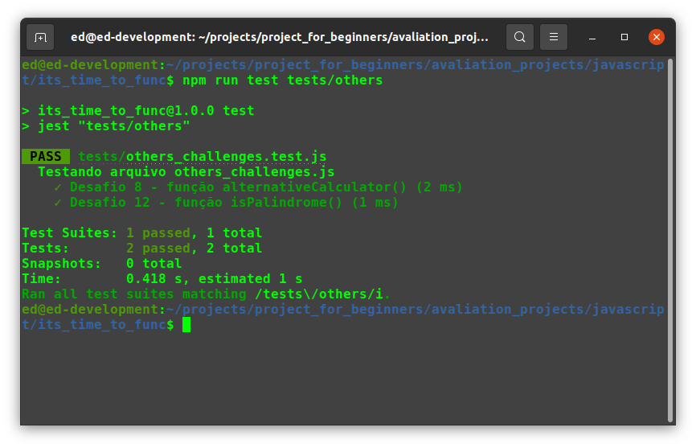
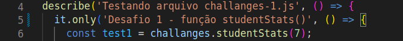
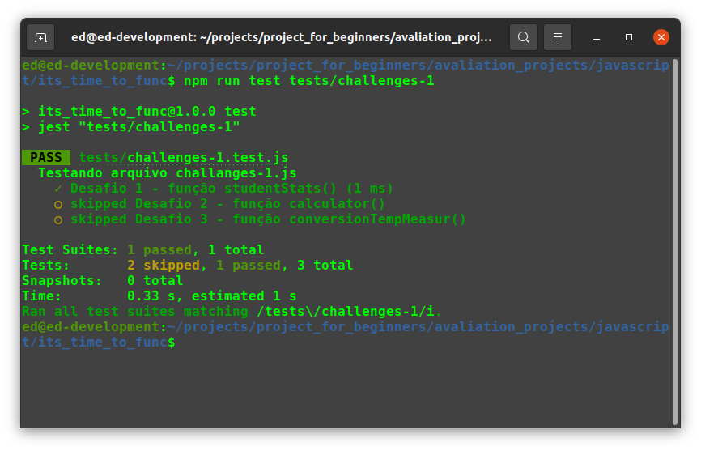

# Bem Vindo ao Projeto It's Time To Func!!!

Este é o segundo projeto *__PorConta__* com o propósito de ajudar aos iniciantes na programação a começarem a desenvolver um *__Portfólio__*. Também ajudará aos que
desejam pegar novos projetos para praticar e se aperfeiçoarem, estendendo, consequentenmente, ainda mais o Portfólio. </br>
Fique a vontade para pegar os projetos e desenvolver à sua maneira, publicar no LinkedIn, mostrar para rescrutadores e tudo mais.

>*__Obs__*.: __LEIA ATENTAMENTE TODO O `README` ANTES DE COMEÇAR O DESENVOLVIMENTO DO PROJETO, POIS NELE ESTÃO CONTIDAS TODAS AS INFORMAÇÕES NECESSÁRIAS PARA O DESENVOLVIMENTO DO PROJETO.__

---

## Sumário
  - [Requisitos Para Desenvolver Este Projeto](#requisitos-para-desenvolver-este-projeto)
  - [Sobre o Projeto](#sobre-o-projeto)
     - [Tecnologias a Serem Utilizadas](#tecnologias-a-serem-utilizadas)
  - [Durante o Desenvolvimento](#durante-o-desenvolvimento)
     - [Mantendo Seu Código Versionado](#mantendo-seu-código-versionado)
  - [Desenvolvendo o Projeto](#desenvolvendo-o-projeto)
     - [Iniciando o Projeto](#iniciando-o-projeto)
     - [Instalando as Dependências](#instalando-as-dependências)
     - [Rodando os Testes](#rodando-os-testes)
  - [Requisitos do Projeto](#requisitos-do-projeto)
     - [Lista de Requisitos](#lista-de-requisitos)
        - [1 - Impelemnte a Função studantStats()](#1---implemente-a-função-studentstats)
        - [2 - Implemente a Função calculator()](#2---implemente-a-função-calculator)
        - [3 - Implemente a Função conversionTempMeasur()](#3---implemente-a-função-conversiontempmeasur)
        - [4 - Implemente a Função counter()](#4---implemente-a-função-counter)
        - [5 - Implemente a Função howMuchWords()](#5---implemente-a-função-howmuchwords)
        - [6 - Implemente a Função letterMoreUsed()](#6---implemente-a-função-lettermoreused)
        - [7 - Implemente a Função biggestElement()](#7---implemente-a-função-biggestelement)
   - [Considerações Finais](#considerações-finais)
---

### Requisitos Para Desenvolver Este Projeto

- VS Code
- NodeJS v14^

Para este projeto você precisa ter instalado em sua máquina um editor de código (sugiro o VS Code pela sua simplicidade e leveza além
de extensões que facilitam muito o desenvolvimento) e o Node na versão 14.0.0 ou superior.

Para saber qual versão do Node está rodando em sua máquina, abra o terminal e execute:

```
node --version
```

Caso precise mudar a versão do Node, uma opção é fazer uso do `NVM` para instalar novas versões e gerenciar as versões do Node em sua máquina.

Para saber se você tem o `NVM` instalado em sua máquina, abra o terminal e execute:

```
nvm --version
```

Você pode aprender mais sobre `NVM` <a href='https://github.com/nvm-sh/nvm'>aqui</a>

---

### Sobre o Projeto

Neste projeto você desenvolverá _funções_ em *__JavaScript__*. Com estas funções você praticará operadores lógicos (_AND - &&_, _OR - ||_ e _NOT - !_), estruturas condicionais (_if/else_, _switch/case_), estruturas de repetição (_for_, _for/in_, _for/of_) e lógica de programação.

>__Obs.1__: Sinta-se à vontade para desenvolver o projeto bem à sua maneira, com suas características, mas vise sempre manter o código mais limpo e legível
possível. *__Mantenha a organização de seus códigos.__*

>__Obs.2__: Na raiz do projeto há um diretório (pasta) chamada *__base_answer__*. Nesta pasta está um exemplo do projeto pronto desenvolvido por mim. A intenção
é que você possa ter um lugar para que possa tirar dúvidas. Busque não se debruçar em cima do projeto pronto, tente fazer do seu jeito, pesquise quando
surgir dúvidas, use este exemplo pronto apenas como último recurso.

#### Tecnologias a Serem Utilizadas

- __JavaScript__

---

### Durante o Desenvolvimento

#### Mantendo Seu Código Versionado

Busque fazer pequenos commits a cada nova funcionalidade do projeto implementada. </br>
É uma boa prática de mercado o uso de `commits semânticos`. Caso ainda não conheça esta prática pode começar a ler sobre eles <a href='https://medium.com/linkapi-solutions/conventional-commits-pattern-3778d1a1e657'>aqui</a>

---

### Desenvolvendo o Projeto

#### Iniciando o Projeto

Para dar o primeiro passo você precisa criar um _fork_ do projeto. Assim você estará puxando o projeto do meu repositório para o seu.

>__Obs.1__: Se você ainda não possui conhecimento sobre como o _fork_ funciona, leia <a href='https://docs.github.com/pt/get-started/quickstart/contributing-to-projects'>este guia</a> sobre _fork_ até a seção `Fazendo e enviando por push as alterações`. </br> Você pode ir além nos conhecimentos sobre _fork_ mas não serão necessários para este projeto.

>__Obs.2__: *__NÃO É NECESSÁRIO ABRIR UM PR (Pull Request)!!!__*

Feito o _fork_, clone o repositório para o seu computador

#### Instalando as Dependências

Para iniciar o projeto certifique-se de instalar as dependências.

Abra o seu terminal na raiz do projeto (o terminal do VS Code já abre na pasta que o VS Code foi aberto) e execute o comando:

```
npm install
```

Executado este comando, serão instaladas todas as dependências do projeto.

#### Rodando os Testes

Para os testes foi utilizado o framework de testes `__Jest__`. Uma ferramenta para fazer testes de código JavaScript de forma simplificada e rápida.

Para começar a testar, com seu terminal aberto na raiz do projeto, execute:

```
npm run test
```
Com este comando serão rodados todos os arquivos de teste.

>

Para rodar apenas um arquivo de teste digite o comando acima mais um trecho ou o nome completo do arquivo como no exemplo abaixo:
```
npm run test tests/others
```
Com este comanto, apenas o arquivo de teste que tem o início do nome sendo `others` será executado (others_challenges.test.js).

>

Caso queira executar apenas 1 teste específico, você pode colocar um `.only` após um `describe` ou `it`.

>

Em seguida, executar apenas o arquivo de teste que contém o teste com o `.only`. Segue um exemplo abaixo:
```
npm run test tests/challenges-1
```

>

---

### Requisitos do Projeto

Faça com calma e atenção. Muito importante a __organização__ de seus códigos.

>## ATENÇÂO!
>#### OS ARQUIVOS `challenges-1.js`, `challenges-2.js` e `others_challenges.js` JÁ FORAM CRIADOS E SUAS RESPECTIVAS FUNÇÕES TAMBÉM. NÃO É NECESSÁRIO A CRIAÇÃO DE NENHUM NOVO ARQUIVO.

#### Lista de Requisitos

### 1 - Implemente a Função *__studentStats()__*
Esta função tem a finalidade de, com base em uma nota de 0 a 10, dizer se é suficiente para um aluno ser _aprovado_, _reprovado_ ou entrar na _recuperação_.

#### Detalhes da função
- Esta função recebe um parâmetro que é um número que pode variar entre 0 e 10;
- Caso o parâmetro recebido seja outro valor fora do esperado, a função deve retornar o texto: `Nota inválida.`;
- Nota de reprovação: 0 à 4,9; Recuperação: 5 à 7; Aprovação: 7,1 à 10.

#### O que será validado
- Será valiado que função retorna o valor esperado de acordo com o parâmetro passado
- Será validado que a função retorna o texto `Nota inválida.` caso seja passado algum valor não esperado pela função.


### 2 - Implemente a Função *__calculator()__*
Esta função tem a finalidade de executar as 4 operações fundamentais da matemática.

#### Detalhes da função
- Esta função recebe 3 parâmetros sendo o primeiro uma _String_ com o sinal da operação e os dois seguintes os números a serem operados;
- Caso o primeiro parâmetro (a _String_) receba um caractere não esperado pela função, a função deve retornar o texto: `Sinal inválido.`.

#### O que será validado
- Será validado que o cálculo de cada operação é feito com sucesso;
- Será validado que a função retorna o texto `Sinal inválido.` caso seja passado algum caractere não esperado pela função.


### 3 - Implemente a Função *__conversionTempMeasur()__*
Esta função tem a finalidade de fazer conversão de medidas de temperatura (_Celsius_, _Kelvin_ e _Fahrenheit_).

#### Detalhes da função
- Esta função recebe 3 parâmetros sendo o primeiro do tipo _INT_ que corresponde à temperatura, e os dois seguintes sendo _STRINGS_. A primeira _STRING_ é a medida atual e a segunda, a medida para a qual será convertido;
- Caso algum parâmetro tenha erro de digitação ou uma palavra errada, a função deve retornar o texto: `Dados incorrentos.`

#### Dicas
- Para a conversão de _Celsius_ para _Fahrenheit_ você pode usar a fórmula: `((9 * degrees) + (5 * 32)) / 5;`;
- Para a conversão de _Fahrenheit) para _Celsius_ você pode usar a fórmula: `(5 * (degrees - 32)) / 9`;
- Para conversão de _Kelvin_ para _Fahrenheit_ você pode, primeiro, converter de _Kelvin_ para _Celsius_ e o resultado converter para _Fahrenheit_ que ficará de _Celsius_ para _Fahrenheit_.

>*__Obs__*: Estas fórmulas foram desenvolvidas por mim. Certamente existem outras fórmulas que você pode encontrar na internet para a conversão dessas medidas.

#### O que sera validado
- Será validado que é possível fazer todas as conversões;
- Será validado que a função retorna o texto: `Dados incorrentos.` caso um parâmetro não seja informado, tenha algum erro de digitação ou alguma palavra errada.


### 4 - Implemente a Função *__counter()__*
Esta função tem a finalidade de preencher um array contando de 1 à 10.

#### Detalhes da função
- Esta é uma função simples que não recebe parâmetros.

#### O que sera validado
- Será validado que a função retorna um array com elementos de 1 à 10.


### 5 - Implemente a Função *__howMuchWords()__*
Esta função tem a finalidade de contar a quantidade de letras que existem numa frase.

#### Detalhes da função
- Esta função recebe um parâmetro que é uma frase completa (uma _STRING_).

#### O que sera validado
- Será validado que a função retorna o texto: `A frase tem ... letras.`. Os 3 pontos precisam ser substituído por números dinâmicos contento a quantidade de letras presentes na frase.


### 6 - Implemente a Função *__letterMoreUsed()__*
Esta função tem a finalidade de encontrar a letra mais usada numa frase.

#### Detalhes da função
- Esta função recebe um parâmetro que é uma frase completa (uma _STRING_).

#### O que sera validado
- Será validado que a função retorna o texto: `A letra mais usada foi "..."`. Os 3 pontos precisam ser substituído pela letra que mais aparece na frase recebida por parâmetro.


### 7 - Implemente a Função *__biggestElement()__*
Esta função tem a finalidade de encontrar, dentro de um _array_, o maior elemento presente (_.lenght()_).

#### Detalhes da função
- Esta função recebe um parâmetro sendo um _array_ de _STRINGs_.

#### O que será validado
- Será validado que a função retorna o maior elemento de um _array_ de _STRINGs_ com o texto: `O maior elemento é "..."`. Os 3 pontos devem ser substituídos pelo maior elemento do array encontrado pela função.

### 8 - Implemente a Função alternativeCalculator()
Esta função tem a mesma finalidade que a função do requisito 2, porém, desta vez, você precisará desenvolver de uma forma diferente, sem usar _if/else_ ou _switch/case_.

#### Detalhes da função
- Esta função recebe 3 parâmetros sendo o primeiro uma _String_ com o sinal da operação e os dois seguintes os números a serem operados;
- Caso o primeiro parâmetro (a _String_) receba um caractere não esperado pela função, a função deve retornar o texto: `Sinal inválido.`.

#### O que será validado
- Será validado que o cálculo de cada operação é feito com sucesso;
- Será validado que a função retorna o texto `Sinal inválido.` caso seja passado algum caractere não esperado pela função.


---
---
---


---

### Considerações Finais

Parabéns por chegar até aqui e concluir este que é o primeiro projeto de muitos que ainda virão por aí!!!


## Muito obrigado pelo seu voto de confiança!

Acesse o nosso grupo do Discord para se manter atualizado com relação a novos projetos, interagir comigo e com outras pessoas, tirar suas dúvidas e ajudar outros colegas.

Link para o Discord: https://discord.gg/MRdcmGZy
